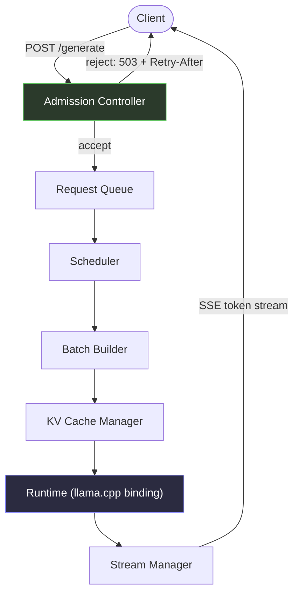
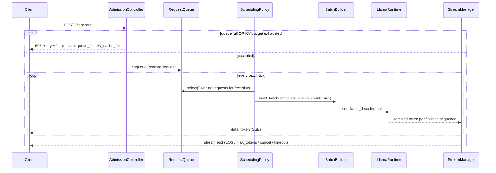
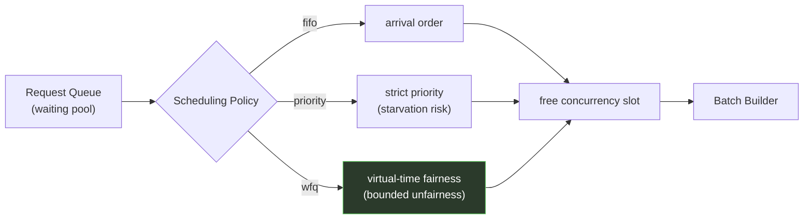
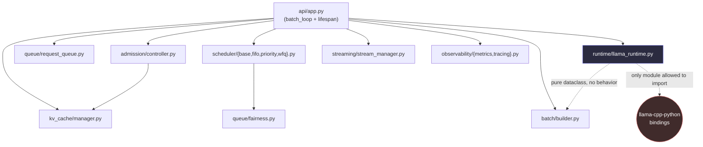
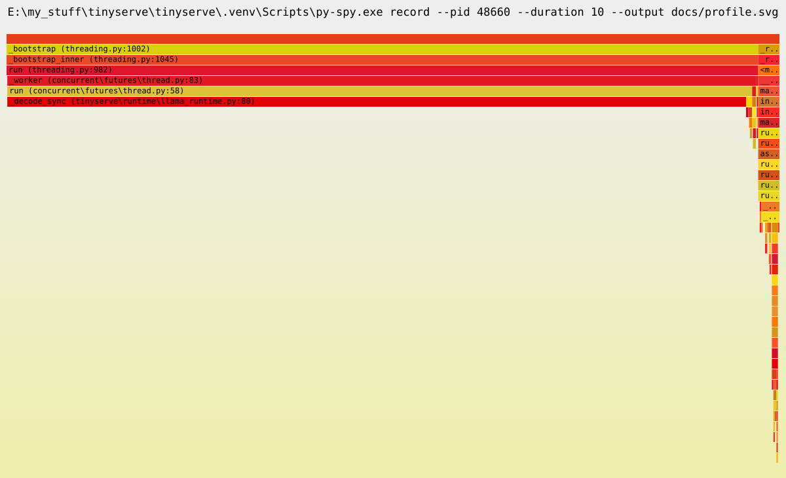

<div align="center">

# TinyServe

**A small, fully-understood LLM inference runtime, built from scratch on top of llama.cpp.**

Continuous batching. Block-based KV-cache accounting. Admission control. Pluggable fair
scheduling. Every latency number this project reports can be traced back to a specific
scheduling decision in its own code — that traceability, not raw throughput, is the point.

[](https://github.com/CyberRik/tinyserve/actions/workflows/ci.yml)
[](./LICENSE)
[](https://www.python.org/)
[](https://github.com/astral-sh/ruff)
[](https://mypy-lang.org/)

</div>

---

## What is this

Serving frameworks like vLLM and SGLang get their performance from a small number of
scheduling ideas — continuous batching, paged KV-cache memory, fairness-aware admission
control — implemented deep inside large, highly-optimized codebases. TinyServe implements
those same ideas, from scratch, in plain async Python, at a scale small enough to hold the
whole system in your head. llama.cpp does the matrix multiplication; **everything above that
line — what runs next, whose tokens go in this batch, when a request gets rejected, how
backpressure reaches the client — is TinyServe's own code**, and it's a few hundred lines per
component, not a few thousand.

This is not an attempt to out-perform production inference engines — see
[Comparison to real systems](#comparison-to-real-systems) for an explicit, un-flattering
table. It's an attempt to build the same *ideas* at a scale where every one of them is
demonstrable, benchmarked, and explainable line-by-line.

```bash
TINYSERVE_MODEL_PATH=models/qwen2.5-0.5b-instruct-q4_k_m.gguf uv run uvicorn tinyserve.api.app:app

curl -X POST http://127.0.0.1:8000/generate \
  -H "Content-Type: application/json" \
  -d '{"prompt": "The capital of France is", "max_tokens": 32}'
```

## Why it exists

Continuous batching, KV-cache management, and fair scheduling are usually learned by reading
about them, not by building them — the real implementations live inside codebases too large
to trace end-to-end in a sitting. TinyServe exists to close that gap: a runtime small enough
that "why was this request slow" always has an answer you can point to in the source, backed
by a real metric or trace span, not a guess.

**What it intentionally solves:**
- Real multi-sequence continuous batching against a single llama.cpp context (not a queue of
  sequential single-request calls)
- Admission control that rejects fast, under two independent conditions (queue depth, KV
  budget), rather than letting latency degrade unboundedly under load
- Three pluggable scheduling policies (FIFO / strict priority / weighted fair queuing) built
  around the one real lever continuous batching leaves a scheduler: admission into a free
  concurrency slot
- Chunked prefill, cooperative cancellation, and queue/generation timeouts
- First-class observability — every scheduling decision emits a Prometheus metric or an
  OpenTelemetry span

**What it intentionally does not solve** (see [Non-goals](#non-goals) for the full list and
reasoning): a from-scratch attention kernel, PagedAttention's actual kernel-level
implementation, multi-GPU or multi-node serving, multi-model serving, or beating vLLM/SGLang
on throughput. These aren't gaps to apologize for — they're deliberate scope lines that keep
the project's actual subject (scheduling) legible.

## Architecture

### High-level pipeline



### Request lifecycle



### Scheduler flow



Continuous batching means every *active* sequence advances one decode step every tick,
regardless of policy — that part isn't negotiable once a sequence holds a slot. The one real
lever a policy has is **which waiting requests claim a free slot next**. All three shipped
policies are, concretely, different answers to that single question — see
[`docs/benchmarks.md`](docs/benchmarks.md#6-scheduler-fairness-fifo-vs-priority-vs-wfq-fairnesspy)
for the measured difference this makes.

### Component relationships



`tinyserve/runtime/llama_runtime.py` is the only file in the codebase allowed to import
llama.cpp bindings — enforced by convention and verified by grep, not by a lint rule. One
background asyncio task (`batch_loop`) owns every call into it, which is what lets the rest of
the system run without locks around llama.cpp state.

Full component-by-component writeup, including every place the shipped code intentionally
diverges from the design doc: [`docs/architecture.md`](docs/architecture.md).

## Runtime pipeline

| Stage | Component | What it does |
|---|---|---|
| 1 | **Admission Controller** | Two fail-fast checks before anything touches the queue: is the waiting pool already at `max_queue_depth`? Is there enough KV budget for `prompt_tokens + max_tokens` worst-case? Either failing returns `503` with `Retry-After` immediately. |
| 2 | **Request Queue** | Holds accepted-but-not-yet-running requests as a reorderable pool — not a blind FIFO. The active scheduling policy decides order. |
| 3 | **Scheduler** | Every batch tick, asks the active policy which waiting requests claim a newly-free concurrency slot. |
| 4 | **Batch Builder** | Pure transformation: merges in-flight decode steps and chunked-prefill slices into one llama.cpp batch call shape. No llama.cpp import. |
| 5 | **KV Cache Manager** | Logical block accounting over llama.cpp's own per-sequence KV API — reserves/releases blocks, tracks free/used counts. Not a physical allocator. |
| 6 | **Runtime** | The only component that calls `llama_decode()`. One call per tick advances every active sequence at once. |
| 7 | **Stream Manager** | Detokenizes incrementally (correct multi-byte UTF-8 handling across token boundaries), pushes to per-request SSE queues, tracks cooperative cancellation. |
| — | **Observability** | Cross-cutting: every decision above emits a Prometheus metric or an OpenTelemetry span. |

## Features

| Feature | Status | Notes |
|---|---|---|
| Continuous batching | ✅ | Real multi-sequence batched `llama_decode()`, not sequential single-request calls — validated with a standalone proof-of-concept before the surrounding architecture was built |
| Chunked prefill | ✅ | Long prompts sliced into `chunk_size`-token pieces per tick; decode steps always sort first |
| Admission control | ✅ | Queue-depth backpressure **and** KV-budget rejection, each with a distinct metric label |
| Scheduling policies | ✅ | FIFO / Priority / WFQ, pluggable via `TINYSERVE_SCHEDULING_POLICY`, benchmarked head-to-head |
| KV cache accounting | ✅ (logical only) | Block-based reserve/release over llama.cpp's native per-sequence KV API — no LRU eviction, and the accounting is not sharing-aware (documented gaps, see below) |
| Prefix caching | ✅ | Block-aligned radix tree in **C++** (`native/`, flat C ABI over ctypes) with a pure-Python fallback; reuses another sequence's KV cells via `llama_memory_seq_cp`. **47–70% of prompt tokens skipped** on a shared-system-prompt wave |
| Streaming | ✅ | SSE, incremental UTF-8-safe detokenization |
| Cancellation & timeouts | ✅ | Cooperative (bounded by one tick), client-disconnect detection, queue and generation timeouts |
| Metrics | ✅ | Prometheus `/metrics` — admission, queue depth/wait, batch size/utilization, KV usage, TTFT, inter-token latency, decode duration, scheduler decisions, cancellations |
| Tracing | ✅ | One OpenTelemetry trace per request, `admission` / `queue_wait` / `generation` child spans |
| Structured logging | ❌ | Not implemented — see [`docs/architecture.md`](docs/architecture.md#observability) |
| Rate limiting | ❌ | Not implemented — see [`docs/architecture.md`](docs/architecture.md#admission-controller--two-checks-not-three) |
| Benchmarks | ✅ | 9 standalone scripts, real numbers, see below |
| Profiling | ✅ | Real `py-spy` session cross-checked against TinyServe's own metrics |
| Deadline scheduling, WebSockets, SRPT | ⏸️ deferred | Remaining Phase 5 stretch goals — see [`PRD.md`](PRD.md) §12 |

## Benchmarks

Nine standalone scripts in [`benchmarks/`](benchmarks/), each run against the real server and
the real Qwen2.5-0.5B-Instruct Q4_K_M GGUF model — every number below is measured, not
estimated. Full write-up with interpretation: [`docs/benchmarks.md`](docs/benchmarks.md).

**Admission backpressure under burst traffic** — TTFT grows with burst size as requests queue
behind `n_seq_max` concurrency slots; at burst=64 admission control rejects 22/64 requests
outright, matching the KV-budget math exactly:

| burst size | accepted | rejected | TTFT p50 (s) | TTFT p95 (s) |
|---|---|---|---|---|
| 8  | 8  | 0  | 0.742 | 1.255 |
| 32 | 32 | 0  | 4.517 | 8.136 |
| 64 | 42 | 22 | 5.567 | 9.638 |

*(full sweep and plot: `benchmarks/results/burst.csv` / `burst.png`)*

**Scheduler fairness** — the core interview artifact. FIFO ignores priority entirely; strict
Priority strongly favors the high-priority class at the low-priority class's expense; WFQ
bounds that unfairness instead of eliminating the favoritism:

| policy | low-priority mean TTFT (s) | high-priority mean TTFT (s) | low/high ratio |
|---|---|---|---|
| FIFO     | 2.121 | 4.761 | 0.45x |
| Priority | 3.716 | 0.960 | 3.87x |
| WFQ      | 3.277 | 1.292 | 2.54x |

**Throughput scaling** — aggregate tokens/sec climbs with concurrent demand, then plateaus
almost exactly at `n_seq_max` (the configured concurrency-slot limit), corroborated
independently by the profiling session below:

| concurrency | 1 | 2 | 4 | 8 | 16 |
|---|---|---|---|---|---|
| agg tokens/sec | 53.8 | 63.8 | 90.2 | 94.3 | 96.1 |

The remaining five benchmarks (single-request baseline, tail latency under chunking on/off,
batch efficiency across request-size distributions, sustained-load KV occupancy, and raw KV
usage over time) are documented in full — including one deliberately-reported **negative
result** (chunked prefill showed no measurable tail-latency benefit at the scale tested, with
the mechanical reason why) — in [`docs/benchmarks.md`](docs/benchmarks.md).

## Profiling

A real `py-spy` sampling session (1202 stack samples over 12s, 100Hz, under continuous
two-sequence load) found **97.2% of wall time inside `llama_decode()`** — TinyServe's own
Python scheduling, batching, and KV accounting account for under 3% of sampled time, spread
across ~15 small framework call sites with no single hotspot of its own. This is cross-checked
quantitatively against TinyServe's own `decode_step_duration_seconds` metric, not just
eyeballed from the sample counts — both measurements agree.



Full write-up, including why there's no Nsight/CUDA section (this build is CPU-only) and what
would change the finding at different scale: [`docs/profiling-notes.md`](docs/profiling-notes.md).

## Comparison to real systems

| | vLLM | SGLang | llama.cpp (server) | TensorRT-LLM | **TinyServe** |
|---|---|---|---|---|---|
| PagedAttention (kernel-level) | Yes | Yes | No | Yes | No — logical accounting only |
| Continuous batching | Yes | Yes | Partial | Yes | Yes (from scratch) |
| Pluggable scheduling policies | Limited | RadixAttention-aware | No | No | Yes — benchmarked head-to-head |
| Multi-GPU / tensor-parallel | Yes | Yes | Limited | Yes | No |
| Custom kernel performance work | Yes | Yes | Yes | Yes (heaviest) | No — relies entirely on llama.cpp |
| Depth of scheduling explainability | Not the focus | Not the focus | Not the focus | Not the focus | **The entire point** |

TinyServe is not competing with any of these on throughput or feature completeness — see
[`PRD.md`](PRD.md) §16 for the full, unflattering self-critique this project holds itself to.

## Non-goals

Explicitly out of scope, so scope creep doesn't happen by accident: a from-scratch attention
kernel or tokenizer, CUDA/Triton kernel work, distributed/multi-node serving, full
kernel-level PagedAttention, multi-model serving, training, and beating vLLM/SGLang/TensorRT-LLM
on throughput. Full reasoning for each: [`PRD.md`](PRD.md) §3.

## Getting started

Requires [uv](https://docs.astral.sh/uv/) and a local GGUF model (a small instruct model like
[Qwen2.5-0.5B-Instruct-GGUF](https://huggingface.co/Qwen/Qwen2.5-0.5B-Instruct-GGUF) is enough
for local development).

```bash
uv sync

TINYSERVE_MODEL_PATH=models/qwen2.5-0.5b-instruct-q4_k_m.gguf uv run uvicorn tinyserve.api.app:app

curl -X POST http://127.0.0.1:8000/generate \
  -H "Content-Type: application/json" \
  -d '{"prompt": "The capital of France is", "max_tokens": 32}'
```

Or run the whole stack (server + Prometheus + Grafana) in Docker with one command:

```bash
cd deploy && docker compose up -d --build
# Grafana: http://localhost:3000  (dashboard pre-provisioned, anonymous admin, local dev only)
# Prometheus: http://localhost:9090
```

### Development

```bash
uv run ruff check .
uv run mypy tinyserve
uv run pytest tests/unit                # fast, no model required
uv run pytest tests/integration -m slow # needs models/qwen2.5-0.5b-instruct-q4_k_m.gguf
```

### Running benchmarks

```bash
uv run python benchmarks/single_request.py
uv run python benchmarks/burst.py --sizes 1,2,4,8,16,32,64
uv run python benchmarks/fairness.py --base-url http://127.0.0.1:8000 --label wfq
```

`tail_latency.py` and `fairness.py` compare server configurations (chunk size / scheduling
policy) and need multiple differently-configured server instances — see each script's
docstring for exact invocations.

## Observability

`GET /metrics` exposes Prometheus-format metrics; every request also gets one OpenTelemetry
trace with `admission` / `queue_wait` / `generation` child spans, printed to the console by
default. See [Profiling](#profiling) and [`docs/architecture.md`](docs/architecture.md#observability)
for what is and isn't covered (structured logging is a known, documented gap).

## Status

Phases 0-4 of the roadmap in [`PRD.md`](PRD.md) §12 are complete: repo/CI/tooling, streaming,
real multi-sequence continuous batching with a block-based KV Cache Manager, pluggable
scheduling with chunked prefill and timeouts, and Prometheus metrics + OpenTelemetry tracing —
plus the full benchmark suite and architecture documentation. Phase 5 (prefix caching,
deadline-aware scheduling, WebSocket transport, SRPT) is explicit optional stretch and was not
picked up. See [`docs/architecture.md`](docs/architecture.md) for the complete, honest list of
every place the shipped code diverges from the design doc.

## Documentation

- [`PRD.md`](PRD.md) — the original design doc: architecture, scheduling tradeoffs, KV-cache
  design, observability plan, phased roadmap, and self-critique
- [`docs/architecture.md`](docs/architecture.md) — what's actually implemented, kept in sync
  with the code, including every documented gap versus the PRD
- [`docs/benchmarks.md`](docs/benchmarks.md) — all 9 benchmarks with real numbers and
  interpretation
- [`docs/profiling-notes.md`](docs/profiling-notes.md) — the `py-spy` investigation, and the
  measurement behind *not* rewriting the Python layer in C++
- [`native/README.md`](native/README.md) — the C++ prefix cache: why that layer is C++ when
  the profiler says Python isn't the bottleneck, how to build it, and how the fallback is
  held to identical behaviour

## License

[Apache 2.0](./LICENSE)
